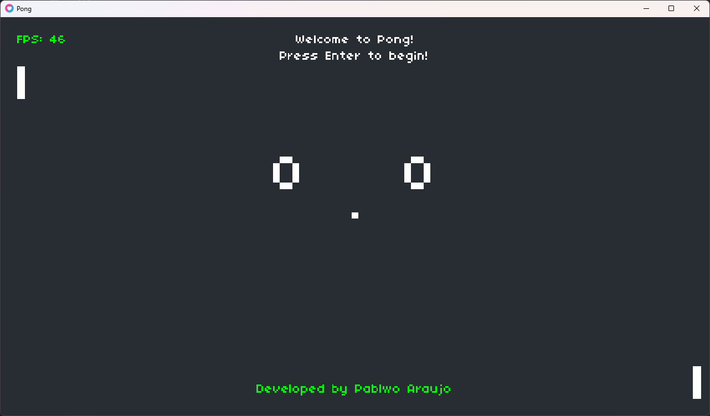
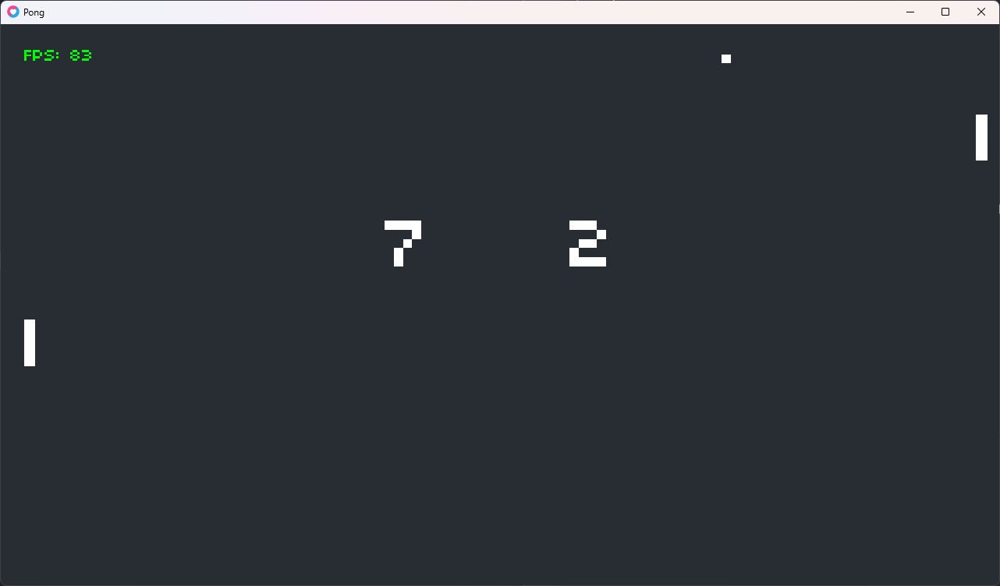

# LOVE-Pong
Pong game in Lua using the LÖVE engine

## 📋 Índice
- [📖 About](#-About)
- [💻 Preview](#-Preview)
- [⚙️ Requirements](#-Requirements)
- [📌 Credits](#-Credits)

## 📖 About
This is my version of the classic Pong game, developed during [Harvard's CS50's Introduction to Game Development](https://www.edx.org/learn/game-development/harvard-university-cs50-s-introduction-to-game-development) course, where I learned the fundamentals of game development, programming concepts using the [Lua](https://www.lua.org) language and some features of the [LÖVE 2D](https://love2d.org) framework.

## 💻 Preview

| Start Screen           |
| ---------------------- |

| Game Screen            | Winner screen          |
| ---------------------- | ---------------------- |
|  |  |

## ⚙️ Requirements
To run this game, you need to download the LÖVE 2D framework. You can get it for free on the official [LÖVE 2D](https://love2d.org) website

## 📌 Credits
-  Course:
    - [Harvard's CS50's Introduction to Game Development](https://www.edx.org/learn/game-development/harvard-university-cs50-s-introduction-to-game-development)
- Sound effects:
    - Sound effects generated in [Bfxr](https://www.bfxr.net)
